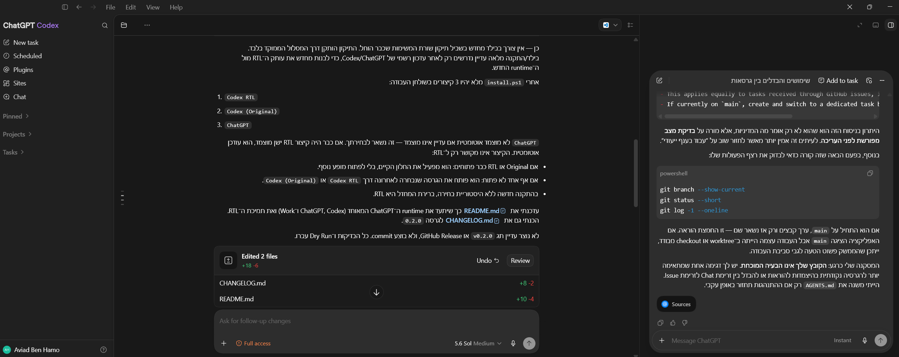
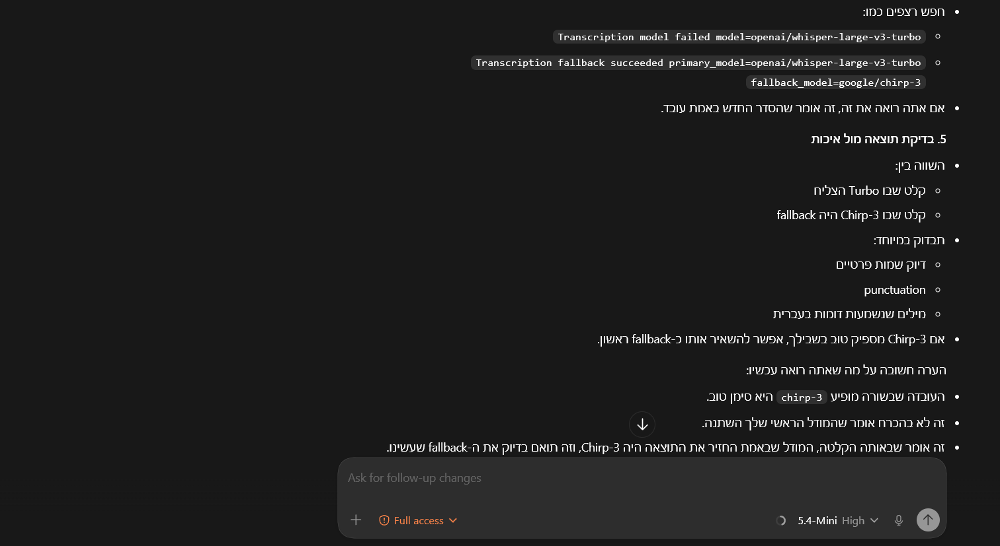
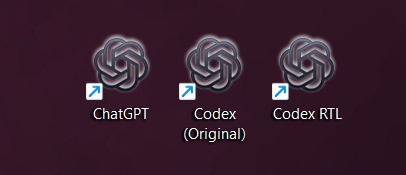

# Codex Desktop RTL Patch for Windows

## Badges

[](LICENSE)

## Project Status

Experimental — release preparation `0.2.0`.

This is an unofficial Windows-only utility for applying a local right-to-left
presentation patch to Codex Desktop. It is maintained for personal production
use and compatibility with current Codex Desktop releases.

This repository is not an OpenAI product.

## Overview

Codex Desktop RTL Patch is based on the original
[`mnigli/codex-desktop-rtl-patch`](https://github.com/mnigli/codex-desktop-rtl-patch)
project by `mnigli`.

This fork keeps the original MIT license and preserves upstream credit. The
current repository adapts the project for the maintained Windows workflow and
adds local usability improvements around installation, launcher safety, update
detection, and recovery.

The current unified ChatGPT Desktop runtime brings ChatGPT, Codex, and Work
into one Windows desktop application. This release adapts the installer and RTL
patch to that `ChatGPT.exe` runtime, with full RTL presentation support for the
supported rendered text surfaces while code, terminals, and editor tooling stay
left-to-right.

The tool creates a separate local copy of the installed Codex Desktop
application, injects RTL presentation logic into that copy, and creates desktop
shortcuts for the patched and original applications, plus a taskbar-friendly
`ChatGPT` activation shortcut.

If an older direct RTL `ChatGPT` shortcut is already pinned to the taskbar, the
installer updates that pin in place; unrelated ChatGPT shortcuts are not changed.

The patch is intended for Hebrew, Arabic, and mixed-language Codex usage. It
keeps code blocks, inline code, terminals, editor-like surfaces, and developer
tooling left-to-right.

The Windows installer does not intentionally modify the official Microsoft
Store / MSIX installation under `C:\Program Files\WindowsApps`.

## Features

- Hebrew and Arabic direction detection for rendered text.
- Mixed-language handling for right-to-left and left-to-right content.
- Left-to-right preservation for code, terminals, Monaco, CodeMirror, and
  syntax-highlighted content.
- Composer direction updates while typing.
- Separate `Codex RTL` and `Codex (Original)` desktop shortcuts.
- A `ChatGPT` shortcut that activates the existing supported window without
  terminating or restarting either runtime.
- Guarded launcher that warns when the official Codex package has changed and
  offers to rebuild the RTL copy with one click.
- Optional local diagnostics monitor for temporarily recording RTL process and
  Windows crash metadata during a reproducible problem.
- Dry-run install and uninstall scripts.
- Recovery documentation for returning to the official Codex application.

## Screenshots / Demo

The screenshots below show the patched Codex Desktop copy rendering Hebrew
right-to-left while preserving readable inline technical content.







This is a local Windows desktop patching utility. There is no hosted public
demo. Validation is performed by running the local test file and manually
checking RTL behavior in the patched Codex Desktop copy.

## Quick Start

Requirements:

- Windows 10 or Windows 11.
- Codex Desktop installed from the official source.
- Node.js 22 or newer, including npm and `npx`.
- Windows SDK, including the x64 `makeappx.exe` and `signtool.exe` tools.
- An administrator PowerShell session for the non-dry-run install and uninstall.
- A reviewed local clone of this repository.

Check prerequisites from PowerShell:

```powershell
Get-AppxPackage -Name OpenAI.Codex
node --version
npx.cmd --version
Test-Path .\src\codex-rtl-patch.js
```

Run a dry run first. For the real install, open PowerShell as Administrator:

```powershell
powershell -NoProfile -ExecutionPolicy Bypass -File .\install.ps1 -DryRun
```

Close all Codex windows, then install the local RTL copy:

```powershell
powershell -NoProfile -ExecutionPolicy Bypass -File .\install.ps1
```

After installation:

- Use `Codex RTL` for the patched RTL copy.
- Use `Codex (Original)` for Microsoft Store updates, troubleshooting, and
  comparison with the unpatched application.
- Pin `ChatGPT` to the taskbar when you want one entry point that activates the
  currently open Original or RTL window. It remembers the last selected variant
  when neither runtime is open.
- Re-run `install.ps1` after Codex Desktop updates.

To remove the patched copy:

```powershell
powershell -NoProfile -ExecutionPolicy Bypass -File .\uninstall.ps1 -DryRun
powershell -NoProfile -ExecutionPolicy Bypass -File .\uninstall.ps1
```

For temporary diagnostic capture during a suspected crash, see
[the maintenance guide](docs/WEEKLY-MAINTENANCE.md#temporarily-capture-rtl-diagnostics).

## Configuration

No `.env` file is required for this repository.

The installer discovers its required inputs from the local machine and the
repository:

- Official Codex Desktop package: `Get-AppxPackage -Name OpenAI.Codex`
- Patch source: `src/codex-rtl-patch.js`
- Launcher source: `src/launch-codex.ps1`
- Local install root: `%LOCALAPPDATA%\OpenAI\CodexRtl`
- ASAR tool: `npx --yes @electron/asar@4.2.0`

The installer also uses the locally installed Windows SDK to register a
per-user sparse MSIX identity for the copied RTL runtime. This is required by
current Codex Desktop builds that use Windows APIs requiring package identity.
It creates one self-signed, code-signing certificate in the current user's
personal store and trusts its public certificate only in Local Machine Trusted
People, which Windows requires for local MSIX package deployment. The
uninstaller removes that certificate and the associated local identity package.
No certificate, package, or application file is added to this repository.

For Electron builds that enable embedded ASAR integrity validation, the
installer also updates the expected ASAR header hash in the copied runtime.
Integrity validation remains enabled and the official Microsoft Store runtime
is not modified. Updating a PE resource invalidates the publisher signature on
the local copied executable; the official executable remains signed and
unchanged.

The absence of `.env.example` is intentional because the project has no runtime
environment variables or secret configuration.

## Process Safety

Codex Desktop, Codex RTL, and editor integrations such as VS Code Codex may all
run similarly named processes. Current unified Codex builds use `ChatGPT.exe`
for the Desktop UI; older builds use `Codex.exe`, while editor integrations may
run their own `codex.exe`. The launcher resolves `ChatGPT.exe` first and falls
back to `Codex.exe`, but must never terminate processes only by executable
name.

Normal launcher flow only terminates processes that are positively identified as
known Desktop app processes, preferably by executable path under:

- Original Codex Desktop under the `OpenAI.Codex` Microsoft Store package app
  directory.
- Codex RTL under `%LOCALAPPDATA%\OpenAI\CodexRtl\app`.

Unknown Codex processes are preserved by default. Broad process cleanup is
allowed only as an explicit manual recovery action, not as part of normal
launcher flow. This prevents VS Code Codex from crashing with `Codex process
errored: Codex process is not available` when switching between Original Codex
and Codex RTL.

## Design Principles

- Keep Codex functionality unchanged; patch RTL presentation only.
- Preserve code editors, terminals, and developer tooling as left-to-right.
- Keep the official Codex Desktop installation available as the recovery path.
- Install into a reversible local copy under `%LOCALAPPDATA%`.
- Fail clearly when a required local file or tool is missing.
- Avoid remote script execution such as piping downloaded content into
  PowerShell.

## Project Structure

```text
.
|-- install.ps1
|-- uninstall.ps1
|-- src/
|   |-- codex-rtl-patch.js
|   `-- launch-codex.ps1
|-- tests/
|   |-- launcher-guard.test.js
|   `-- rtl-direction.test.js
|-- assets/
|   `-- screenshots/
|-- docs/
|   |-- BROWSER-USE-COMPATIBILITY-INVESTIGATION.md
|   |-- RECOVERY.md
|   `-- WEEKLY-MAINTENANCE.md
|-- CHANGELOG.md
|-- ROADMAP.md
|-- SECURITY.md
|-- LICENSE
`-- README.md
```

This repository officially supports Windows only.

Some macOS-related files from the upstream project remain in the repository for
reference and potential future community work, but they are not currently
maintained or officially supported by this repository.

## Architecture

The project is script-driven rather than package-driven.

Runtime flow:

1. `install.ps1` locates the official `OpenAI.Codex` package.
2. The installer mirrors the official app into
   `%LOCALAPPDATA%\OpenAI\CodexRtl\app`.
3. The copied `resources\app.asar` is extracted with `@electron/asar`.
4. `src/codex-rtl-patch.js` is copied into the extracted webview assets.
5. `webview/index.html` is patched to load the RTL script.
6. The ASAR is repacked in the local copy.
7. If the runtime enforces embedded ASAR integrity, the copied executable's
   expected header hash is updated to match the patched ASAR without disabling
   integrity validation.
8. A locally signed sparse MSIX package grants package identity to the copied
   RTL runtime without modifying the official OpenAI package.
9. Desktop shortcuts are created for `Codex RTL`, `Codex (Original)`, and
   `ChatGPT`. The `ChatGPT` shortcut is a no-kill taskbar activation entry point.
10. `src/launch-codex.ps1` stops only recognized Codex Desktop processes before
   launching the selected variant.
11. When launching `Codex RTL`, the launcher compares the official Codex version
   with the recorded RTL source version and displays a rebuild prompt when the
   official app has changed.

The original Codex installation remains the source of truth for updates. The
RTL copy must be rebuilt after official Codex Desktop updates.

## Development

Run the direction test:

```powershell
node .\tests\rtl-direction.test.js
```

Run the launcher guard test:

```powershell
node .\tests\launcher-guard.test.js
```

Run installer validation without changing files:

```powershell
powershell -NoProfile -ExecutionPolicy Bypass -File .\install.ps1 -DryRun
```

Manual regression checklist:

- Hebrew text is readable and aligned right-to-left.
- Arabic text is readable and aligned right-to-left.
- English text remains left-to-right.
- Mixed Hebrew or Arabic with English remains readable.
- Code blocks and inline code remain left-to-right.
- Terminal output, file paths, toolbars, buttons, and links are not globally
  mirrored.

Additional documentation:

- [Browser Use compatibility investigation](docs/BROWSER-USE-COMPATIBILITY-INVESTIGATION.md)
- [Recovery procedure](docs/RECOVERY.md)
- [Weekly maintenance guide](docs/WEEKLY-MAINTENANCE.md)
- [Security policy](SECURITY.md)

## Roadmap

See [ROADMAP.md](ROADMAP.md).

## Changelog

See [CHANGELOG.md](CHANGELOG.md).

## License

This project keeps the same MIT License as the original
[`mnigli/codex-desktop-rtl-patch`](https://github.com/mnigli/codex-desktop-rtl-patch)
project. The upstream copyright notice is preserved in [LICENSE](LICENSE).

This fork credits the original creator and documents the Windows-specific
adjustments and maintenance improvements made here.
